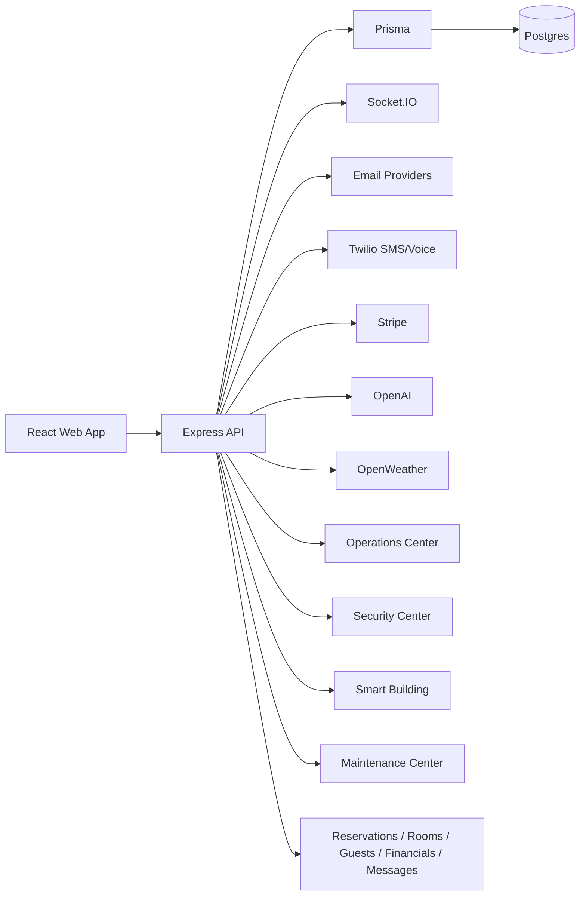
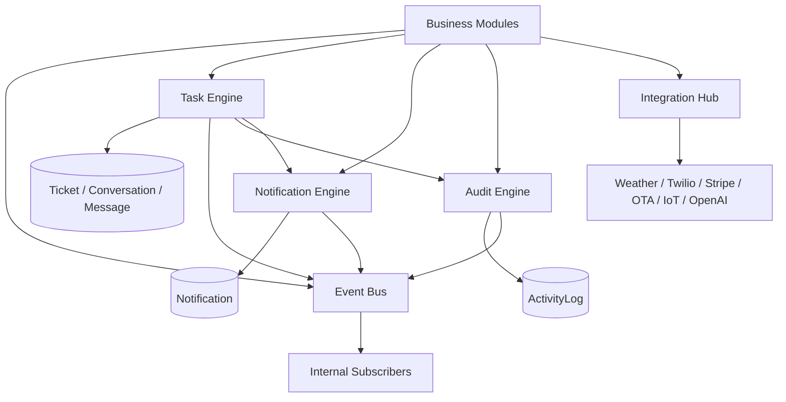
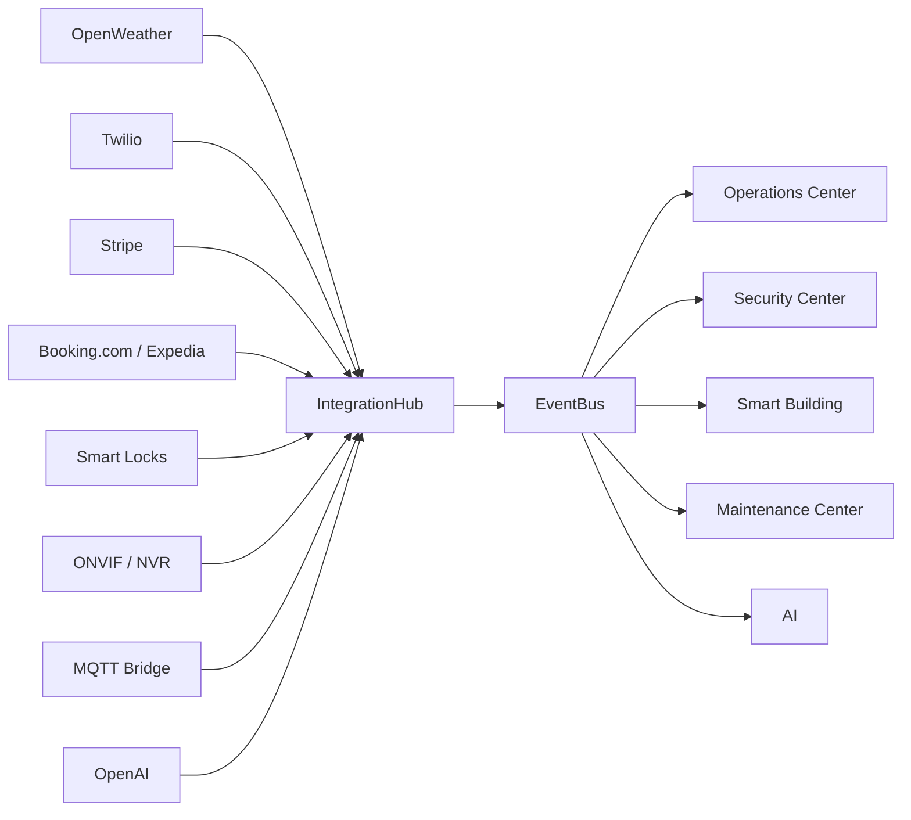
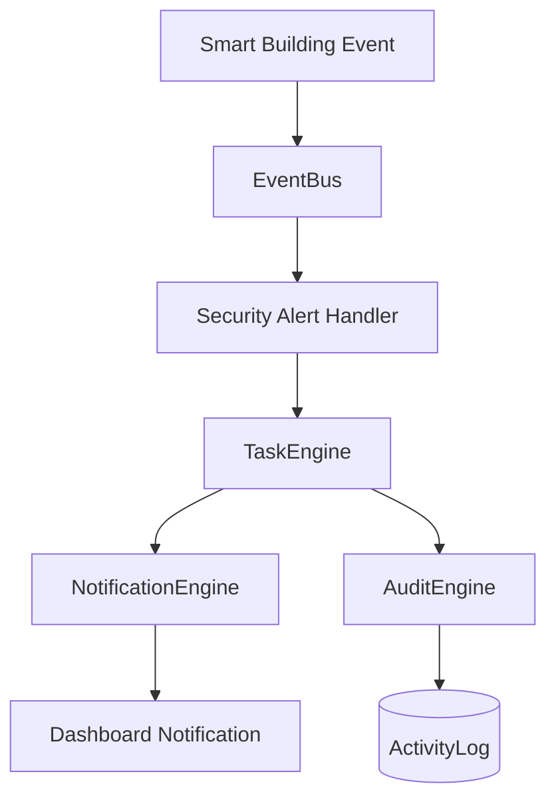

# LaFlo Platform Foundation

Date: 2026-06-27

This document describes the shared platform core added for LaFlo. The goal is to let current and future modules communicate through stable internal services instead of coupling directly to one another.

This is not a microservices split. Everything remains inside the current monorepo and API process, but the boundaries are designed so they can be extracted later if needed.

## Current Platform



Current issue:

- Modules can call shared tables and services directly.
- Audit writes are scattered as direct `ActivityLog` writes.
- Notifications are mostly dashboard-notification oriented.
- Integrations are implemented as direct provider calls.
- Task behavior is currently tied to `Ticket` flows.

## New Platform Core



Added services:

```text
packages/api/src/platform/event-bus/eventBus.service.ts
packages/api/src/platform/tasks/taskEngine.service.ts
packages/api/src/platform/notifications/notificationEngine.service.ts
packages/api/src/platform/audit/auditEngine.service.ts
packages/api/src/platform/integrations/integrationHub.service.ts
packages/api/src/platform/index.ts
```

## 1. Event Bus

Service:

```text
packages/api/src/platform/event-bus/eventBus.service.ts
```

Purpose:

- Provide a shared internal event abstraction.
- Decouple modules from direct cross-module calls.
- Carry hotel scope, event metadata, timestamps, and correlation IDs.

Capabilities:

- `eventBus.publish(event)`
- `eventBus.subscribe(eventType, handler)`
- `eventBus.subscribeAll(handler)`
- event metadata
- hotel scoping
- correlation IDs
- causation IDs
- timestamps
- schema version
- user ID metadata
- short-lived in-memory idempotency support

Current implementation:

- In-process `EventEmitter`
- Safe for current monolith
- Designed for later replacement with Redis, Postgres outbox, Kafka, NATS, or another broker

Example event shape:

```ts
{
  metadata: {
    eventId,
    eventType,
    hotelId,
    source,
    correlationId,
    causationId,
    idempotencyKey,
    publishedAt,
    schemaVersion,
    userId,
  },
  payload,
}
```

## 2. Task Engine

Service:

```text
packages/api/src/platform/tasks/taskEngine.service.ts
```

Purpose:

- Create one reusable task abstraction for Operations, Security, Smart Building, Maintenance, Housekeeping, Reservations, AI, and future modules.
- Avoid each module inventing its own task lifecycle.

Current storage:

- Reuses existing `Ticket`, `Conversation`, `Message`, and `ActivityLog`.
- No database migration required for this milestone.

Capabilities:

- `createTask()`
- `assignTask()`
- `completeTask()`
- `reopenTask()`
- `escalateTask()`
- `addTaskComment()`
- `addTaskAttachment()`
- `getTaskAuditHistory()`

Behavior:

- Publishes task events through Event Bus.
- Writes audit history through Audit Engine.
- Sends dashboard assignment notifications through Notification Engine.
- Stores comments and attachments as conversation messages.

Future extraction path:

- If `Ticket` becomes too support-specific, introduce a first-class `PlatformTask` table later and keep this engine API stable.

## 3. Notification Engine

Service:

```text
packages/api/src/platform/notifications/notificationEngine.service.ts
```

Purpose:

- Centralize notification dispatch across channels.
- Give all modules one notification API.

Supported channels:

- `DASHBOARD`
- `EMAIL`
- `SMS`
- `PUSH` future placeholder
- `TEAMS` future placeholder

Capabilities:

- `notifyUser()`
- `notifyRoles()`

Current behavior:

- Dashboard notifications use the existing `Notification` model.
- Email uses the existing email service.
- SMS uses the existing SMS/Twilio service.
- Push and Teams are intentionally registered as future channels and return skipped delivery results until configured.
- Dispatches `notification.dispatched` events through Event Bus.

## 4. Audit Engine

Service:

```text
packages/api/src/platform/audit/auditEngine.service.ts
```

Purpose:

- Replace scattered direct `ActivityLog` writes with one reusable audit service.
- Preserve a consistent audit event shape.

Capabilities:

- `recordAuditEvent()`
- `getAuditHistory()`

Current behavior:

- Writes to existing `ActivityLog`.
- Publishes `audit.recorded` events.
- Publishes `audit.skipped` events when no actor is available.
- Supports transaction clients so audit records can be written inside business transactions.

First migration:

- Weather sync audit writes now use the Audit Engine.

Future migration:

- Booking changes
- Room changes
- Ticket/task lifecycle
- Payment/refund actions
- User/permission changes
- AI-generated actions
- IoT event ingestion
- Visitor check-in/check-out
- Alert acknowledgement/resolution

## 5. Integration Hub

Service:

```text
packages/api/src/platform/integrations/integrationHub.service.ts
```

Purpose:

- Provide one registry for external integrations.
- Make external provider status and capabilities discoverable.
- Keep provider-specific code behind clear boundaries.

Registered integrations:

- OpenWeather
- Twilio
- Stripe
- Booking.com future
- Expedia future
- Smart Locks future
- ONVIF / CCTV future
- MQTT Bridge future
- OpenAI

Capabilities:

- `registerIntegration()`
- `getIntegration()`
- `listIntegrations()`
- `getIntegrationReadiness()`

Integration strategy:

- Current provider-specific services remain in place.
- New modules should discover provider availability through Integration Hub.
- Future adapters should normalize vendor payloads into platform events.
- Vendor-specific implementation should stay behind adapter boundaries.

## Integration Points



Module usage target:



## Migration Plan

### Phase 1: Additive Foundation

Status: started.

- Add platform services.
- Keep all existing module behavior working.
- Migrate one low-risk direct audit path to prove the pattern.

### Phase 2: Audit Migration

Replace direct `prisma.activityLog.create()` calls with `recordAuditEvent()` in:

- Auth
- User permissions
- Reservations
- Rooms
- Payments
- Messages
- Tickets
- AI actions
- Smart Building events
- Security Center visitor and alert actions
- Maintenance work order/fault/repair actions

### Phase 3: Task Migration

Replace direct task/ticket creation paths with Task Engine calls:

- Operations advisories
- Pricing actions
- AI suggested actions
- Security alerts requiring action
- Maintenance faults
- Housekeeping tasks
- Guest service requests

### Phase 4: Notification Migration

Move module-specific notifications into Notification Engine:

- Ticket assignment
- SLA breach
- Security alert
- Smart Building alert
- Visitor workflow
- Payment status
- Booking status
- AI generated task

### Phase 5: Event-Driven Module Boundaries

Introduce internal subscribers:

- `smart-building.alert.created` -> Security Center alert handling
- `security.alert.critical` -> Task Engine escalation
- `maintenance.fault.created` -> Notification Engine
- `booking.checked_in` -> Rooms/Housekeeping updates
- `payment.completed` -> Invoice notification
- `ai.action.approved` -> Task Engine

### Phase 6: Durable Eventing

If scale requires it, replace the in-memory Event Bus internals with:

- Postgres outbox
- Redis streams
- NATS
- Kafka

The public Event Bus API should stay stable.

## Design Rules Going Forward

New modules should:

- publish platform events instead of directly calling unrelated modules
- create operational work through Task Engine
- send notifications through Notification Engine
- write audits through Audit Engine
- access external providers through Integration Hub or provider adapters

Modules should not:

- write direct cross-module records without a platform event
- create their own task lifecycle
- create direct `ActivityLog` writes
- call external vendors from controllers
- embed provider-specific logic in UI-facing services

## What This Does Not Do Yet

- It does not create microservices.
- It does not add new database tables.
- It does not replace all existing audit writes yet.
- It does not replace all ticket creation flows yet.
- It does not add durable event persistence yet.
- It does not add vendor HMAC/API-key auth yet.

## Next Recommended Step

Migrate the existing high-value flows to the platform services in this order:

1. Operations advisory ticket creation -> Task Engine
2. Pricing action ticket creation -> Task Engine
3. Smart Building security alerts -> Event Bus + Notification Engine
4. Security Center alert actions -> Audit Engine
5. Maintenance work order/fault/repair actions -> Task Engine + Audit Engine
6. Auth/user permission changes -> Audit Engine

